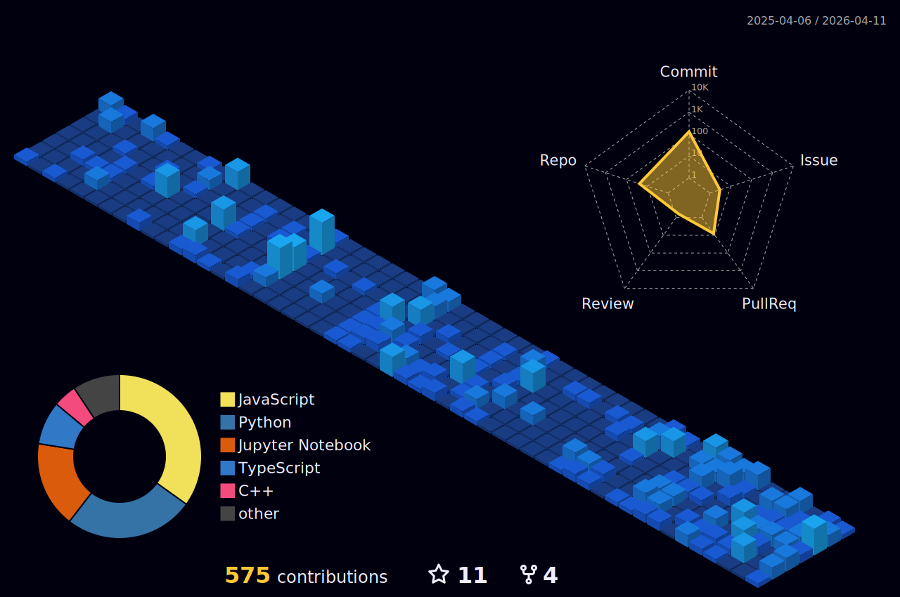

# Hello, I'm <a href="https://www.aadijoshi.com">Aadi</a> 👋
  
 

  
  ## I mainly work with
  
  

### Full activity graph:
###### (includes private repos and leetcode submissions)
  
  

<!--    -->

  

  
  <!--  -->

